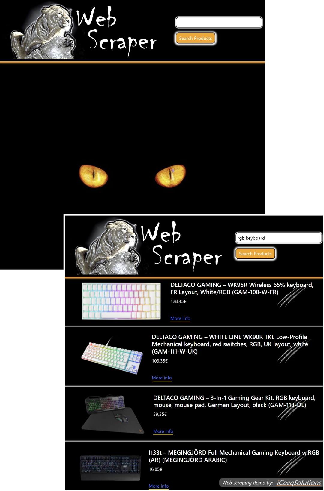

# Web Scraper - a Flask demo using Beautiful Soup to scrape data.

  Flask Demo by <a href="https://iceeqsolutions.fi/">iCeeqSolutions</a>

## About

The web scraper scrapes the products catalogue of a Finnish computer web shop. Type into the search field e.g. "RTX 4090" to get a list of all available 4090 graphic cards that they have in stock. The list will contain the product name, the price and the link to the product.

## Demo

To test out the web scraper, download the repository and preferably start a virtual environment and then use the "requirements.txt" file to easily install all necessary dependencies:
pip install -r requirements.txt

## Built with

- Python
- Flask
- Beautiful Soup
- Bootstrap

## Features

- Python classes
- Python functions
- Routing
- Template engine (Jinja2)
- Template inheritance
- Flask web form - flask-wtf
- Web scraping

  

  
